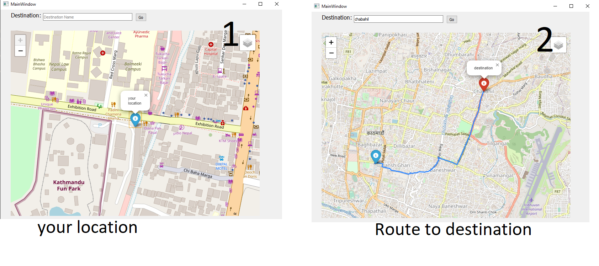
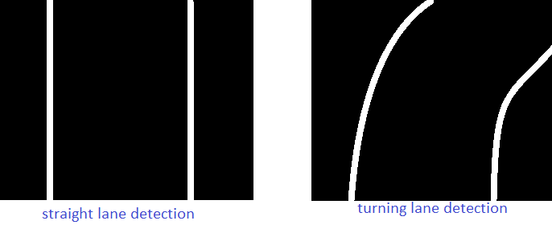

# Mini Autonomous Vehicle 🚗🤖
This is a prototype for small autonomous vehicle that autonomously navigates to a given destination using a pathfinding algorithm, traffic detection, and object distance measurement. This project integrates Raspberry Pi as the central control system and Arduino for motor driver control, enabling seamless movement.

🚀 How It Works
1. User Input (Destination Selection)
The user provides the destination location through a UI.
The system calculates the path to the specified destination using navigation algorithms.
2. Path Navigation
While driving, the car suggests where to move next.
It follows the computed path and weighs the prescribed direction as the major decision factor.
3. Traffic Detection and Obstacle Avoidance
The system uses custom trained YOLO model for traffic light detection and uses an ultrasonic sensor for distance calculations.
4. Device Control
Raspberry Pi acts as the main brain of the system for processing and decision-making.
Arduino is used for motor driver control, enabling the car's movement.

<div>
  <p>
    <a align="center" href="https://github.com/Ganesh-tamang/small-autonomous-vehicle" target="_blank">
  </p>

<div>

# Installation

Clone repo and install requirements.txt

```bash
https://github.com/Ganesh-tamang/small-autonomous-vehicle.git
cd small-autonomous-vehicle
pip install -r requirements.txt  # install

python main/destination_code.py
```

# For your own prototype, do:
1. Camera calibration:     Take 20 pictures of chess board from your camera and place the images in images folder.
   ```bash
    run camera_calibrate.ipynd # to obtain camera matrix

   ```         
3. Copy camera matrix to main/camera.py
4. Place your camera to suitable position such that it shows your lane properly 
5. Take 4 points of your lane and transform it in required destnation to do prespective transform.Copy it in src and dst matrix in perspective transform function  in camera.py

    Tips: Place some square material in a lane and, then transform it such that it shows square  after transforming
    
6. run
```bash
     python main/destination_code.py
```

# Circuit diagram


# Map route 



# lane detection test output


# our small prototype


# Future Enchancement:
1. Use Gps module to exactly know your location instead of using ip address
2. Use directions value to take turns at prescribed locations. 
 
    TIP: Take location value from Gps module and match it with location list,then turn left or right according to direction value

3. Calculate velocity of others cars in a road
4. Use more advanced tools like Radar, Lidar,Gps module etc 
