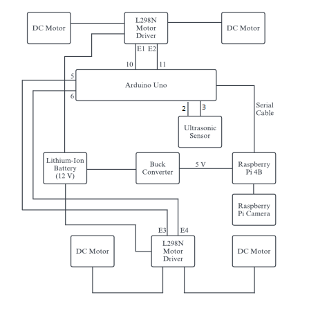
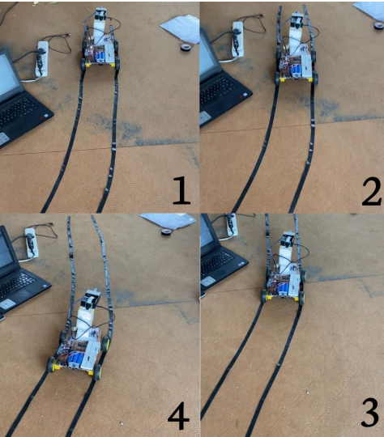

# small-autonomous-vehicle
This is a prototype for small autonomous vehicle.

<div>
  <p>
    <a align="center" href="https://github.com/Ganesh-tamang/small-autonomous-vehicle" target="_blank">
  </p>

<br>

<div>


# Install

Clone repo and install requirements.txt

```bash
https://github.com/Ganesh-tamang/small-autonomous-vehicle.git
cd small-autonomous-vehicle
pip install -r requirements.txt  # install
```

# STEPS TODO:
1. Camera calibration: Take 20 pictures of chess board from your camera and place the images in images folder. Then, Run camera_calibrate.ipynd as saved camera matrix
2. Copy camera matrix to main/camera.py
3. Place your camera to suitable position such that it shows your lane properly 
4. Take 4 points of your lane and transform it in required destnation to do prespective transform.Copy it in src and dst matrix in perspective transform function  in camera.py

    Tips: Place required square material in a lane and, then transform it such that it shows square  after transforming
    
5. run main/destination_code.py

# Circuit diagram

Circuit diagram


# model prototype



# Future Enchancement:
1. Use Gps module to exactly know your location instead of using ip address
2. Use directions value to take turns at prescribed locations. 
 
    TIP: Take location value from Gps module and match it with location list,then turn left or right according to direction value

3. Calculate velocity of others cars in a road
4. Use more advanced tools like Radar, Lidar,Gps module etc 
